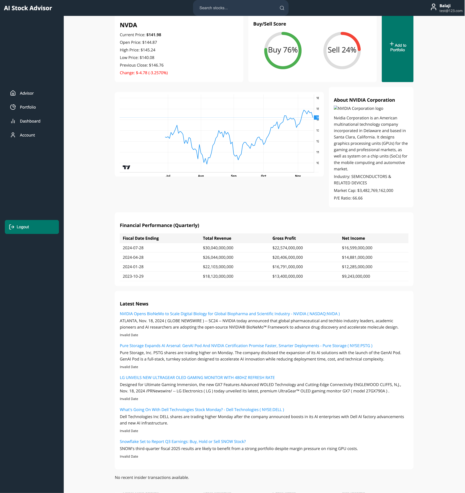

## **AI-Stock Advisor System** 🚀  

### **Overview**  
AI-Stock Advisor System is an AI-powered stock market analysis platform that provides **real-time insights, trend predictions, and financial analytics** using **LangChain agents, Nvidia NIM models, and Retrieval-Augmented Generation (RAG)**. It integrates **live stock data, financial reports, and AI-powered chat interactions** to help users make informed investment decisions.  


This system features:  
✅ **Live stock data retrieval** (from APIs like Alpha Vantage, FinnHub, FMP)  
✅ **AI-powered financial insights** using LangChain agents and Nvidia NIM  
✅ **Retrieval-Augmented Generation (RAG)** for context-aware responses  
✅ **User authentication & portfolio management** (Azure Cosmos DB)  
✅ **Seamless CI/CD pipeline & cloud deployment** (Docker, GitHub Actions, Heroku)  


---

### **Tech Stack**  

#### **Frontend (React.js) [🔗 GitHub Repo](https://github.com/asish-kun/AI-Financial-Advisor-UI)**
- **Minimal & responsive UI** for intuitive stock analysis  
- **Real-time stock visualization** with interactive charts  
- **Chatbot interface** for AI-driven insights  

#### **Backend (Flask API) [🔗 GitHub Repo](https://github.com/asish-kun/AI-Financial-Advisor)**
- **API for stock data, authentication, AI responses**  
- **Orchestrates LangChain Agents** (Crew-based AI model)  
- **Fetches & processes live stock data** from Alpha Vantage, FinnHub, and FMP  

#### **AI Model Server [🔗 GitHub Repo](https://github.com/siddu2484/BTP_GEN_AI)**
- **Nvidia NIM-powered AI models** for advanced financial text embeddings
- **Langchain Agents** for orchestrating tasks  
- **ChromaDB integration** for storing financial embeddings  
- **Handles financial query understanding & document similarity matching**  

---

### **Architecture** 🏗  

1️⃣ **User Input**: Users search for stocks or ask financial questions via the chatbot.  
2️⃣ **Data Retrieval**: Crew Agents fetch **live stock prices, trends, news & financials** from APIs.  
3️⃣ **AI Processing**:  
   - **Nvidia NIM** creates embeddings for financial documents.  
   - **ChromaDB** retrieves the most relevant info for user queries.  
   - **LangChain Agents** generate AI-powered financial insights.  
4️⃣ **Response Generation**: The AI synthesizes the information into **clear, actionable insights** and sends it to the frontend.  

🚀 **Deployed via Docker, Netlify (Frontend), and Heroku (Backend) with CI/CD automation.**  

---

### **Key Features**  
✅ **AI-Powered Chatbot** – Get stock advice in natural language  
✅ **Real-Time Data** – Fetches stock quotes, earnings reports, and market trends  
✅ **Portfolio Management** – Track & analyze personal investments  
✅ **Retrieval-Augmented Generation (RAG)** – AI answers grounded in real financial data  
✅ **Secure Authentication** – Built with Azure Cosmos DB & Flask sessions  

---

### **Application Screen UI**

**Landing Page** 


**Home Screen View** 


**Advisor Chat View** 


**Portfolio Management View** 


**Stock Details View** 


---

## **Setup & Deployment** 🚀  

Follow these steps to set up and run the **AI-Stock Advisor System** locally using Docker or manually.  

**⚠️ Note:** The application was previously deployed on Heroku, but the servers have been closed. If running locally, ensure you **reconfigure ports** in the frontend and backend settings to match your local environment.

---

### **1. Clone the Repositories**  
Open a terminal and clone all necessary repositories:  
```bash
git clone https://github.com/asish-kun/AI-Financial-Advisor-UI.git  # Frontend
git clone https://github.com/asish-kun/AI-Financial-Advisor.git  # Backend
git clone https://github.com/siddu2484/BTP_GEN_AI.git  # AI Model Server
```

---

### **2. Backend Setup (Flask API)**
#### ** Method 1: Run with Docker (Recommended)**
Ensure Docker is installed, then navigate to the backend folder and run:  
```bash
cd AI-Financial-Advisor
docker build -t ai-advisor-backend .
docker run -p 5000:5000 ai-advisor-backend
```
The backend will now be available at `http://localhost:5000`.

#### ** Method 2: Manual Setup (Virtual Environment)**
1. **Create a virtual environment**:  
   ```bash
   python -m venv venv
   ```
2. **Activate the virtual environment**:  
   - Windows: `venv\Scripts\activate`  
   - macOS/Linux: `source venv/bin/activate`  
3. **Install dependencies**:  
   ```bash
   pip install -r requirements.txt
   ```
4. **Set up environment variables**:  
   - Create a `.env` file in the root folder and add necessary API keys & database credentials.  

5. **Run the Flask server**:  
   ```bash
   python app.py
   ```
   The API will now be running on `http://localhost:5000`.

---

### **3. Frontend Setup (React.js)**
#### ** Running in Development Mode**
1. Navigate to the frontend directory:  
   ```bash
   cd ../AI-Financial-Advisor-UI
   ```
2. Install dependencies:  
   ```bash
   npm install
   ```
3. Start the development server:  
   ```bash
   npm start
   ```
   The frontend will be available at **`http://localhost:3000`**.

#### ** Build for Production**
If you want to create an optimized production build:
```bash
npm run build
```
This will generate a `build/` folder containing the optimized app.

---

### **4. AI Model Server Setup**
**⚠️ This repository is private, so ensure you have the correct access.**  

1. Navigate to the AI model directory:  
   ```bash
   cd ../BTP_GEN_AI
   ```
2. Run the AI model server (assuming it’s set up for Flask or FastAPI):  
   ```bash
   python app.py
   ```
3. Ensure the backend correctly connects to the AI model server at the configured endpoint.

---

### **5. Reconfiguring Ports & URLs**
Since previous deployments used Heroku, you **must update ports and API URLs** in the frontend and backend:
- **Frontend (`AI-Financial-Advisor-UI/src/config.js` or similar file)**  
  Update API URLs to match `http://localhost:5000` instead of any previous Heroku link.
- **Backend (`AI-Financial-Advisor/.env`)**  
  Ensure the API connects to the correct AI Model Server running locally.

---

### **6. Running the Full System**
After setting up all components:
1. **Start the Backend**
   - Via Docker: `docker run -p 5000:5000 ai-advisor-backend`
   - Or manually: `python app.py`
2. **Start the Frontend**
   ```bash
   npm start
   ```
3. **Start the AI Model Server**
   ```bash
   python app.py
   ```

Now visit `http://localhost:3000` to use the **AI-Stock Advisor System**.

---

## **Need Help?**  
Open an **issue** in the respective GitHub repository or check the documentation for troubleshooting.

🚀 **Ready to explore AI-powered stock insights? Get started now!**

---

### **Future Enhancements** 🔮  
🚀 **Advanced AI Agents** (Adding Technical & Fundamental Analysis Agents)  
📈 **Predictive AI Models** (LSTMs, ARIMA for stock forecasting)  
🛠 **Scalability Improvements** (Kubernetes deployment for high-load environments)  

---

